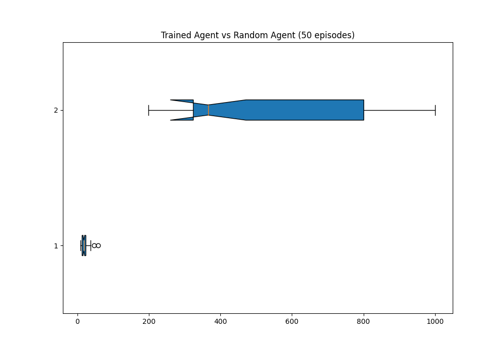
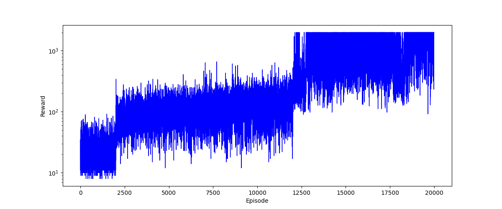
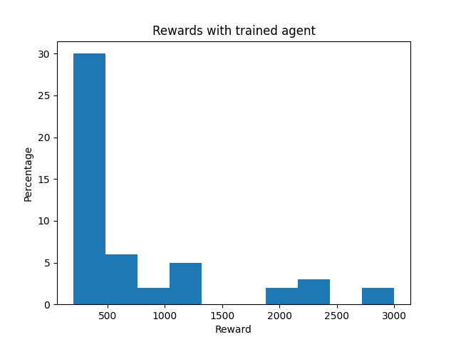
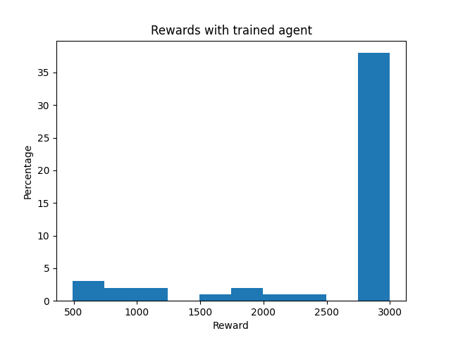
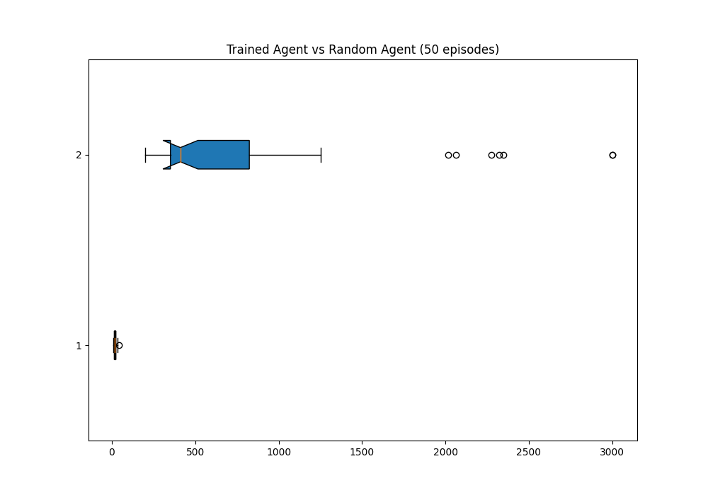
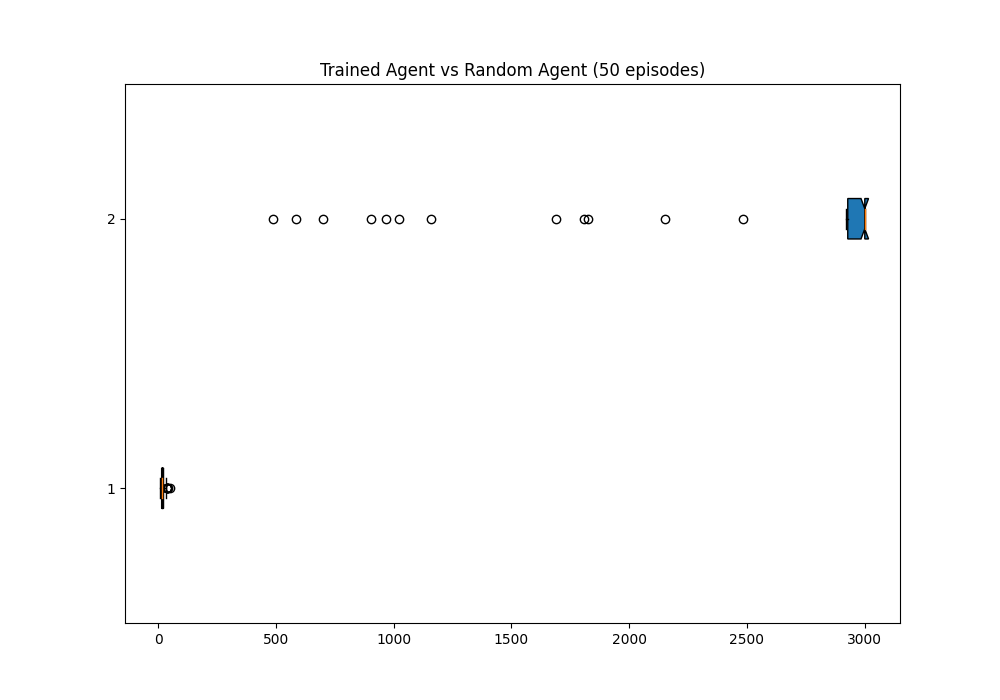

# Cartpole Reinforcement Learning

This repository is a project focused on exploring reinforcement learning techniques using the OpenAI Gym environment. The objective is to compare different algorithms and approaches to improve the performance of an agent in the Cartpole task.

## Installation
Installation of packages
```
pip install -r requirements.txt
```

If you want to execute the the training phase and get your own model execute the main program, the hyperparameters and different options can be changes via config.ini file.

If you just want to watch the trained model play the game execute


## Objectives

The main objectives of this project are as follows:

1. Develop a working model that demonstrates an increase in survival time through training.
2. Experiment with different reinforcement learning algorithms and compare their training time, complexity, and achieved scores.
3. Fine-tune the algorithm parameters and the number of bins used to achieve optimal training results.
4. Improve the consistency of the trained agent's strategy.
5. Implement experience replay to enhance learning.

## Results

The initial approach used in this project was Q-Learning, and it produced the following results:


The convergence plot shows an increase in the score over time, with three distinct phases. The first phase corresponds to random inputs, followed by a phase where the model explores a lot. The third phase occurs when the epsilon value starts to decay.


Comparing the results of the trained agent (after 20,000 episodes) with a random agent clearly demonstrates the improvement achieved:



Despite the improvements, the trained agent still lacks consistency. This inconsistency is believed to be due to the inherent randomness in the Cartpole environment.

## Experience Replay

Experience replay has been implemented in this project, leading to significant improvements in the agent's performance. The details and results of this implementation are yet to be provided.

The results of the trained agent with experience replay are as follows:

| Metric                 | Old Agent | Trained Agent with Experience Replay |
|------------------------|--------------|--------------------------------------|
| Convergence Plot       |  |  |
| Score Histogram        |  |  |
|Boxplot|| |

As observed by adding experience replay the agent has been able to objectively increase it's score.

