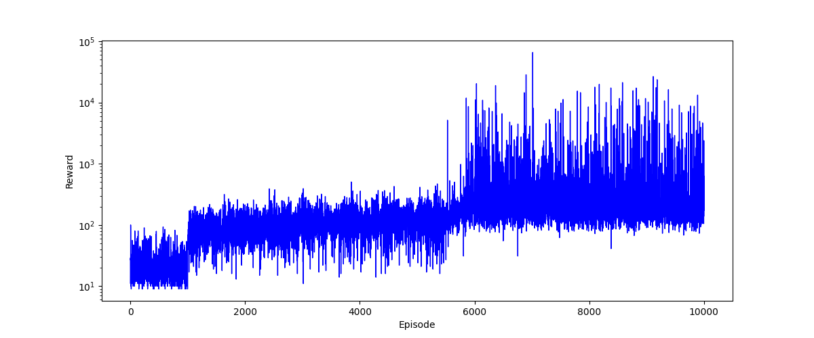
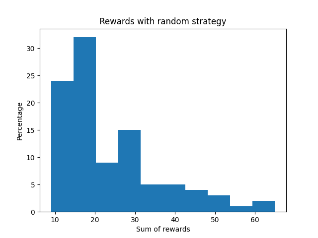

# Cartpole
This repository is a project in which I seek to take my first steps in reinforcement learning via OpenAI gym. 
My objective is to compare different reinforcement learning ideas from simple algorithms to more complex ones.

The obtained results were the following

This repository has been heavily inspired in the following:
https://aleksandarhaber.com/q-learning-in-python-with-tests-in-cart-pole-openai-gym-environment-reinforcement-learnin

